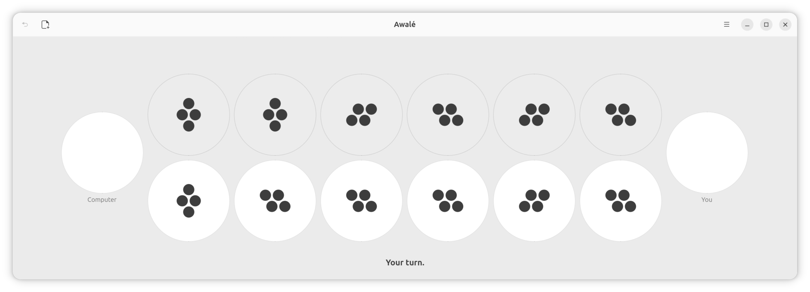

# Awalé

Play Awalé against the computer.

> **awalé** \\a.wa.le\\  
> Strategy games originating in West Africa, in which pebbles, seeds, or shells are distributed into small bowls or pits.

## Installing

```sh
curl -L -o /tmp/awale.flatpak \
    https://github.com/benjaminbellamy/awale/releases/download/1.0.2/awale-1.0.2.flatpak \
    && flatpak install --user --bundle /tmp/awale.flatpak
```

The first install also pulls the GNOME 50 runtime if you do not already have it,
which needs Flathub set up as a remote. To build from source instead, see
[Building](#building).



Awalé is a sowing game of the mancala family, played across West Africa and the
Caribbean, and known elsewhere as oware, awélé or wari. Two players face each
other over twelve houses holding forty-eight seeds, sowing them one at a time
around the board and capturing the ones that fall the right way.

This is a GNOME desktop game written in Vala. It follows the Oware Abapa rules,
the ones used in competition.

## Features

- Three difficulty levels, which can be changed in the middle of a game.
- A learning mode that stars the best move and explains it, without ever
  forcing your hand.
- Arrows over the board, in the same mode, tracing what every house would
  capture from either row, and what the computer could take from you next.
- Seed counts you can show or hide, independently of the difficulty.
- Full keyboard play, with every house reachable and described aloud.
- An adaptive board: side by side in a wide window, turned a quarter turn in a
  narrow one.
- Your game is kept when you close the window and restored when you return.
- Help pages and interface in English, French, German, Italian, Spanish and
  Dutch.

## Playing

Houses are numbered 1 to 6 along your row, left to right.

| Key | What it does |
| --- | --- |
| `1` to `6` | Play that house of your row |
| `Tab` | Move between houses, including the computer's |
| `Ctrl+Z` | Undo your last move |
| `Ctrl+N` | Start a new game |
| `L` | Turn learning mode on or off |
| `S` | Show or hide the seed counts |
| `Esc` | Step out of the board |

The number keys work on the number pad as well as on the top row.

## Building

The build needs Meson 1.0 or later, Vala, blueprint-compiler, gettext, and the
development files for GLib 2.76, GTK 4.14 and libadwaita 1.5 or later.

On Ubuntu 26.04, which is what this was developed on:

```sh
sudo apt install valac meson ninja-build blueprint-compiler gettext \
    libglib2.0-dev libgtk-4-dev libadwaita-1-dev \
    appstream desktop-file-utils
```

The last two are only needed to run the full test suite; the build skips those
tests when the tools are absent.

```sh
meson setup builddir
meson compile -C builddir
```

### Running without installing

The game reads its settings through GSettings, so the schema compiled into the
build tree has to be pointed at:

```sh
GSETTINGS_SCHEMA_DIR=builddir/data builddir/src/ui/awale
```

Translations are picked up from the build tree too, so a language chosen in the
menu works uninstalled.

### Installing from source

```sh
meson install -C builddir
```

### Flatpak

```sh
flatpak-builder --user --install --force-clean build-aux/flatpak \
    build-aux/flatpak/fr.benjaminbellamy.Awale.yaml
```

The manifest asks for a window, a GPU and nothing else. There is deliberately no
network permission of any kind.

## Tests

```sh
meson test -C builddir
```

Eight of the targets exercise the engine, one per area of the rules: setup,
moves, sowing, capture, grand slam, termination, search and advice. The rest
check the packaging — that the AppStream metainfo validates, that the GSettings
schema compiles, that the desktop file is well formed, and that no source file
holds a translatable string without being listed in `po/POTFILES.in`.

## The engine on the command line

`awale-cli` drives the engine with no interface attached, for testing and self
play. It is built but not installed, and not shipped in the Flatpak.

```
awale-cli show [POSITION]
awale-cli moves [POSITION]
awale-cli play HOUSE [POSITION]
awale-cli perft DEPTH [POSITION]
awale-cli search LEVEL [POSITION]
awale-cli selfplay [--seed=N] [--max-plies=N] [--level=LEVEL] [--quiet]
```

A position is written as two rows, the two stores and the side to move, and
defaults to the opening position:

```sh
builddir/src/cli/awale-cli moves "4,4,4,4,4,4 | 4,4,4,4,4,4 | S:0 N:0 | to_move=S"
```

## Layout

```
src/core/    the rules engine and the AI: plain Vala and GLib, no GTK
src/cli/     the headless engine driver
src/ui/      the GTK4 and libadwaita interface
tests/       engine tests, one target per area of the rules
docs/help/   the in-app help pages, one per language
data/        desktop file, icons, AppStream metainfo, GSettings schema
po/          translation catalogues
build-aux/   packaging and build-time checks
```

`src/core/` never links against GTK. Every question about legality, capture or
termination is answered there, and the interface only retells what it reports.

## Translations

The interface and the help pages are available in English, French, German,
Italian, Spanish and Dutch.

The five translations other than English are machine-generated and have not been
reviewed by a speaker. Their catalogue headers say so. Corrections are welcome.

## Licence

AGPL-3.0-or-later. See [LICENSE](LICENSE).
